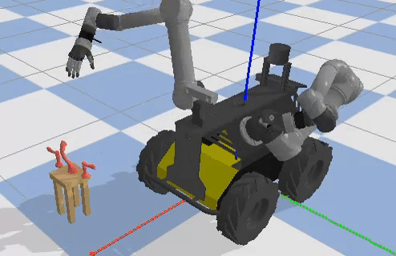
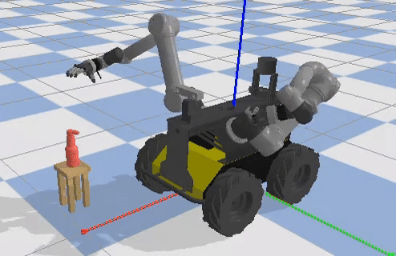
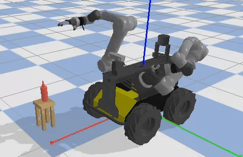
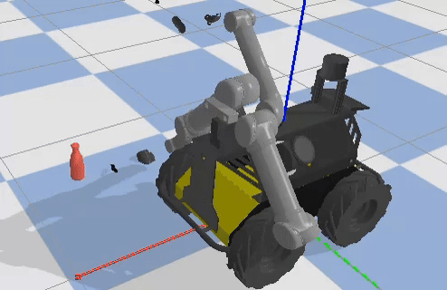
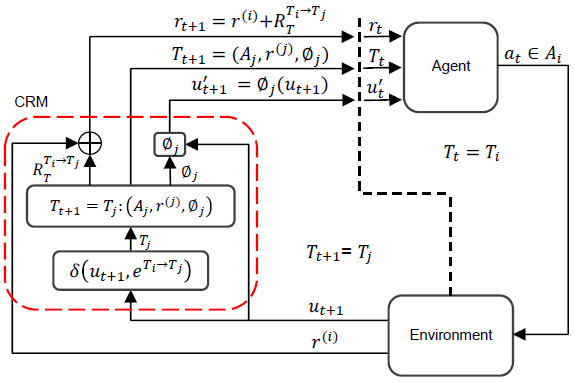

# Overview
This repository provides the simulation environment for the DexMobile platform and the source code for the CRM-PPO reinforcement learning model, designed for task-oriented grasping.

 

# DexMobile Platform

The platform consists of a Husky UGV (Unmanned Ground Vehicle) for mobility, two UR5e robotic arms, a Schunk SVH robotic hand (right), and a PSYONIC Ability Hand (left). Each robotic hand is mounted on a UR5e arm, and both arms are integrated with the Husky base.

 

The simulation environment is developed using PyBullet within the Gym framework. It supports reinforcement learning and enables various applications, including dexterous manipulation, dual-arm coordination, or autonomous navigation tasks.

# Context-Aware Task-Oriented Grasping
A reinforcement learning framework that incorporates a Contextual Reward Machine for context-aware task-oriented grasping is proposed and implemented based on the DexMobile platform.

 

The Contextual Reward Machine reduces task complexity by decomposing grasping tasks into manageable subtasks. Each sub-task is associated with a stage-specific context, including a reward function, an action space, and a state abstraction function. 

 

Integrated with Proximal Policy Optimization, the proposed Contextual Reward Machine significantly improves learning efficiency, task robustness, and adaptability. It achieved a 95% success rate across 1,000 grasping tasks involving diverse objects, affordances, and grasp topologies.

 

CRM-PPO is compared with state-of-the-art baselines and outperforms them in task success rate and task completion time.

 

The trained model was transferred to the real world environment and aviheved a success rate of 83.3%.

 

This paper has been submitted to IEEE Transactions on Systems, Man, and Cybernetic: Systems